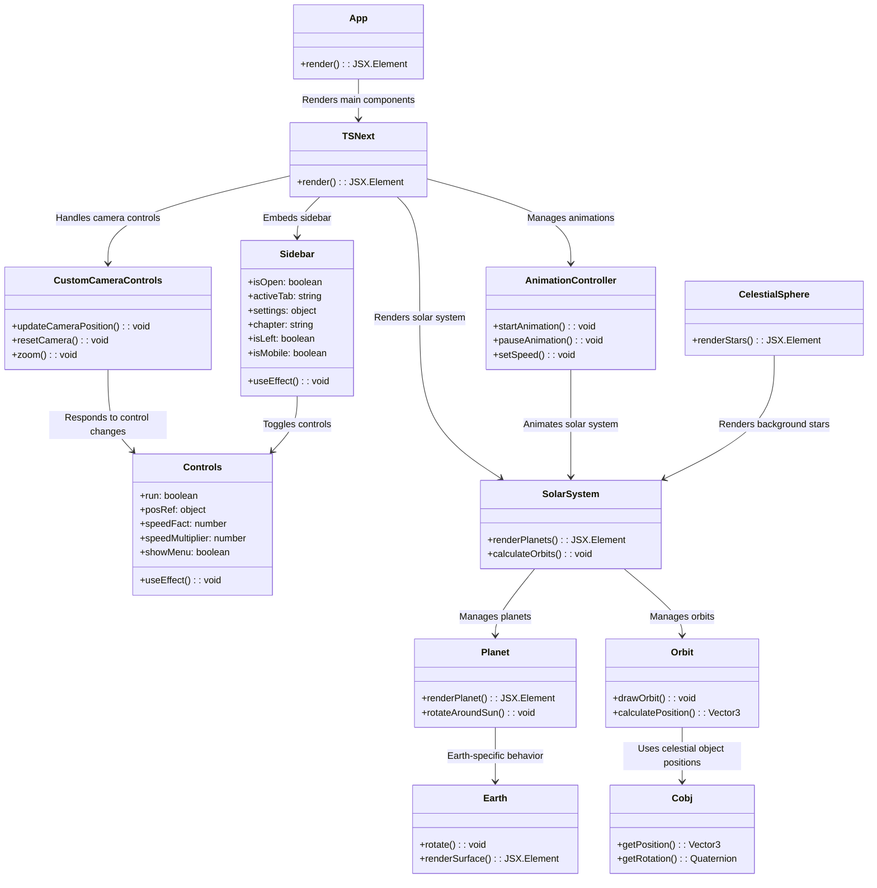

# Tychosium Development

## Mermaid diagram

## Commits
- [x] Added sidebar that displays a chapter of the book in an `iframe` using a new component called `Sidebar.tsx`
- [x] Added CSS padding for `rightclick` on planets.
- [x] Added CSS padding for `posWriter` on planets.
- [x] Added clickable text on `TYCHOSIUM`, for minimizing the UI panel.
- [x] Added mobile `breakpoint` for responsiveness `768px`
- [x] Changed font on `leva` object for a more coherent style.
- [x] Added `weight` to the cross symbol next to the tychosium text.
- [x] Added a feature where each planet has a short description, *though descriptions are pending*.
- [x] Added all chapters for the book in the settings menu

## Bugs
- [ ] `follow` and `planetView` and functions alike should be cancelable by using `ESC` key
- [ ] Mobile version
- [ ] Settings are not mobile-friendly, and the `close` button is inaccessible.
    - [ ] Unable to double-click or right-click on planets; this only occurs in Chrome's viewer.
- [ ] There's no easy way to stop focusing on an object (not to be confused with `Camera: follow`).
- [ ] Neptune lacks texture, which might be intentional due to the lack of high-resolution images for all planets.
- [ ] Missing a loading bar for long loading times.
- [ ] Simulation stutters when running (could be an issue with my computer).

## Features
- [ ] **Mobile version**
    - [ ] UI adjusted to the screen size and control panel (responsiveness).
- [x] **Tooltip**
    - [x] Use tooltips to inform about theoretical concepts (e.g., PVP orbit).
- [ ] **Controls**
    - [ ] Ability to use arrow keys to move forward and backward in time.
- [ ] **Fullscreen**
    - [ ] A way to enable fullscreen without making the button too easy to access.
- [ ] **URL**
    - [ ] The URL should include the camera position, allowing more precise linking within the system.
- [ ] **Interval**
    - [ ] To better observe phenomena, allow playing a specific interval between two years at a given speed.
- [ ] **.icon**
    - [ ] Create an .icon that displays when opening a new tab.
- [ ] Glow on hover over object/planet.
